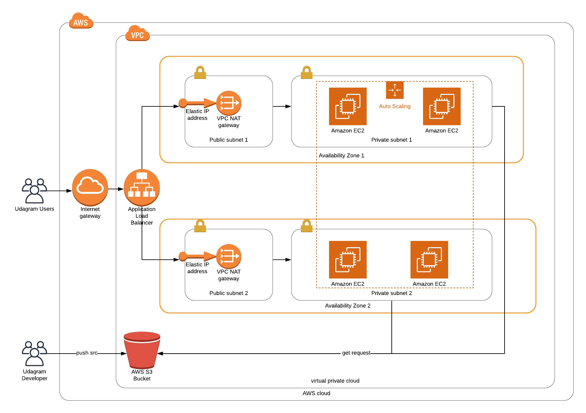

# Deploy a high-availability web app

> Second Project of the Udacity DevOps Nanodegree Program

> Shell, DevOps, AWS, Udacity

---

## Table of Contents 

- [Intruduction](#intruduction)
- [Requirements](#requirements)
- [Achitecture](#achitecture)
- [Example](#example)
- [Installation](#installation)
- [WebAppUrl](#webapprl)
- [Credits](#credits)

## Intruduction

Your company is creating an Instagram clone called Udagram. Developers pushed the latest version of their code in a zip file located in a public S3 Bucket.

You have been tasked with deploying the application, along with the necessary supporting software into its matching infrastructure.

This needs to be done in an automated fashion so that the infrastructure can be discarded as soon as the testing team finishes their tests and gathers their results.

---

## Requirements

You'll need to create a Launch Configuration for your application servers in order to deploy four servers, two located in each of your private subnets. The launch configuration will be used by an auto-scaling group.

You'll need two vCPUs and at least 4GB of RAM. The Operating System to be used is Ubuntu 18. So, choose an Instance size and Machine Image (AMI) that best fits this spec. Be sure to allocate at least 10GB of disk space so that you don't run into issues. 

Since you will be downloading the application archive from an S3 Bucket, you'll need to create an IAM Role that allows your instances to use the S3 Service.

Udagram communicates on the default HTTP Port: 80, so your servers will need this inbound port open since you will use it with the Load Balancer and the Load Balancer Health Check. As for outbound, the servers will need unrestricted internet access to be able to download and update its software.

The load balancer should allow all public traffic (0.0.0.0/0) on port 80 inbound, which is the default HTTP port. Outbound, it will only be using port 80 to reach the internal servers.

The application needs to be deployed into private subnets with a Load Balancer located in a public subnet.

One of the output exports of the CloudFormation script should be the public URL of the LoadBalancer.

---

## Achitecture



---

## Example

```shell
$ chmod +x scripts/create.sh 
$ ./scripts/create.sh <STACKNAME> network.yml parameter/network-parameters.json
```

---

## Installation

### Clone

- Clone this repo to your local machine using `git clone https://github.com/UltraViolentLight/webapp_deployment`

### Setup
> Setup and configure your own AWS subscription in order to deploy the infrastrcuture yourself.

> Setup and configure AWS CLI to run the aws command as shown [here](https://aws.amazon.com/de/cli/).

---

## WebAppUrl

- The Udagram WebApp can be reached under the following URL (port 80):

- [http://udagr-WebAp-1QVDEHJFL50LQ-451831188.us-west-2.elb.amazonaws.com](http://udagr-WebAp-1QVDEHJFL50LQ-451831188.us-west-2.elb.amazonaws.com)

---

## Credits

- All Data was provided by the Udacity Data Analyst Nanodegree Program 


